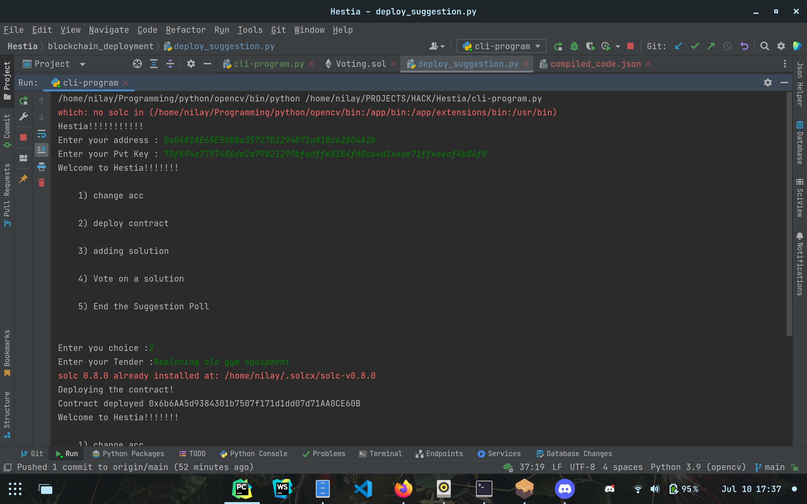
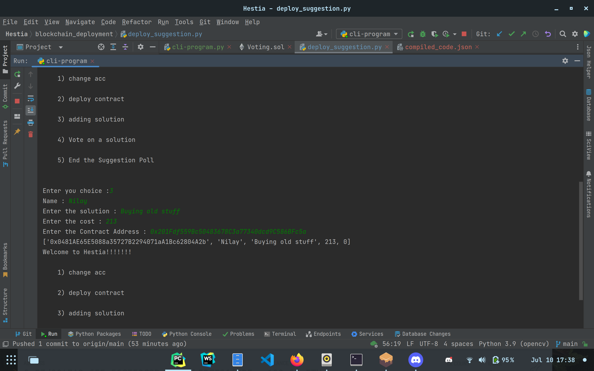
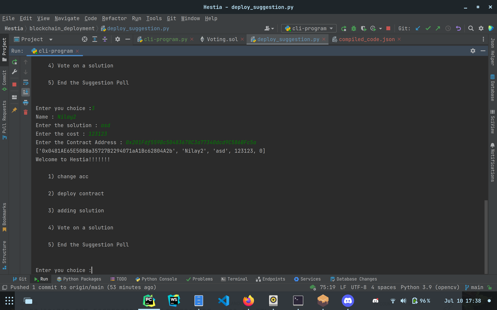
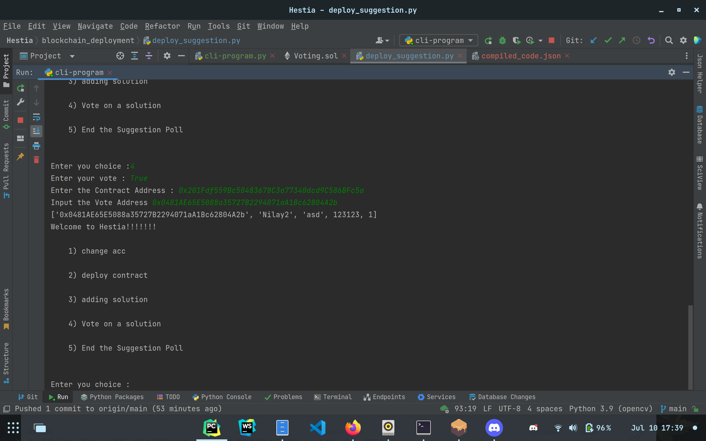
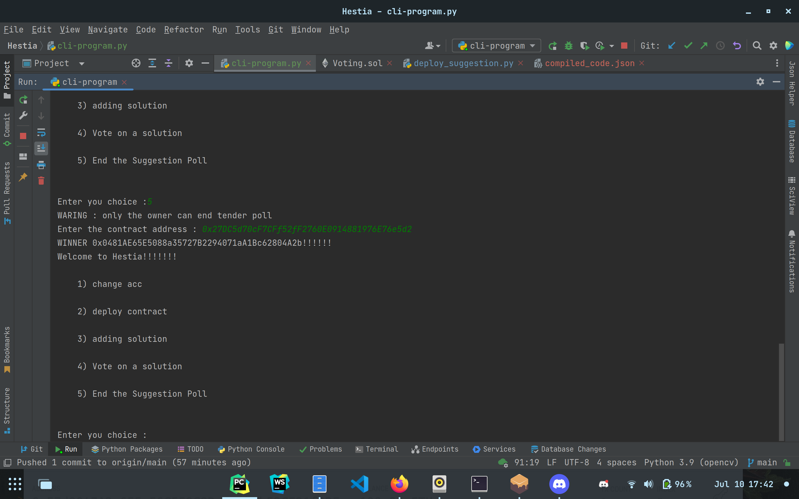
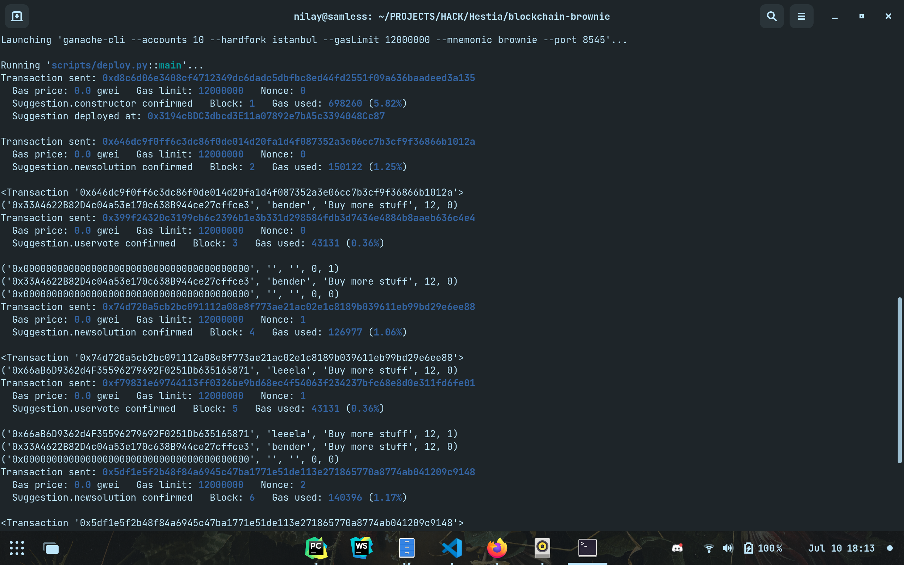
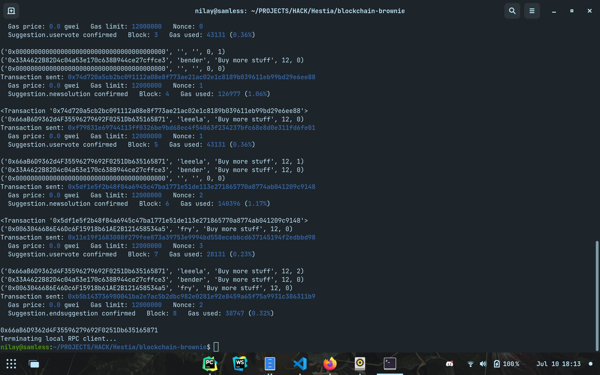
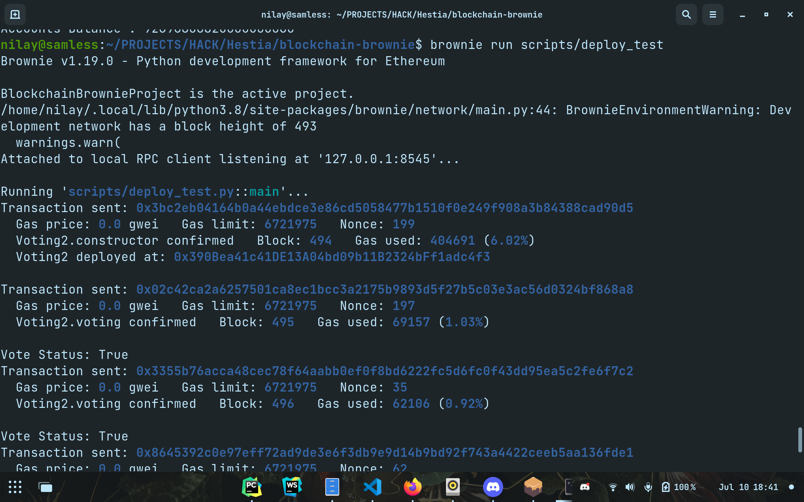
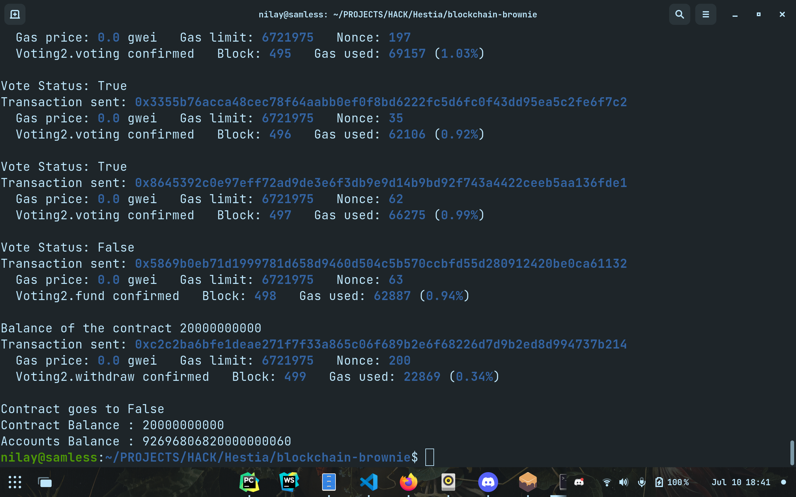
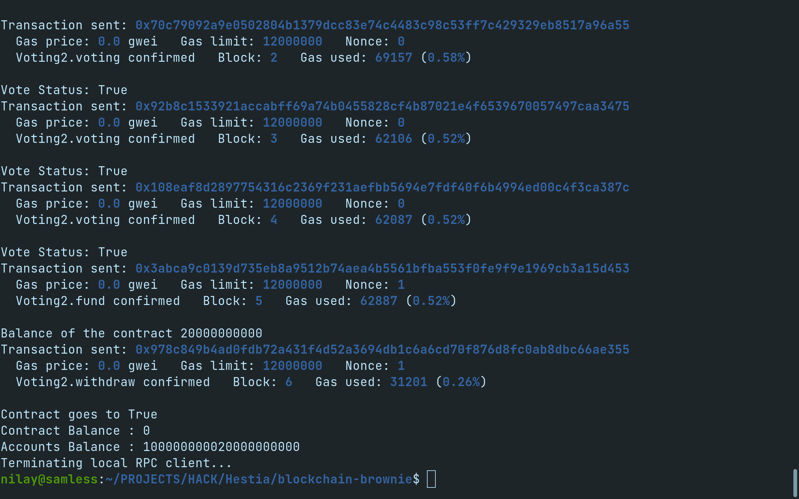

### About

Removes the tedious-convoluted voting systems and removes those long and boring meetings to mere proposal statements. It introduces a decentralized way of voting , which while being more sophisticated it also allows a level of transparency generally not scene in centralized voting systems.

### How it works

1. People can raise their requirements
2. Others can quote a tender or post a solution
3. This solution is visible to everyone
4. Everyone votes on these solutions and the highest voted one is declared the winner.
5. The winner of the contract is then supposed to start working on the project and get it checked by the  concerned authorities(decided by owner of the contract)
6. When the concerned authority votes yes the funds are immediately transferred.

### Features

1. Decentralized way of storage
2. Decentralized voting
3. Decentralized Funding based on Quality Check by Authorities

### Example

1. CLi program for the suggestions part

2. Brownie Run for Suggestion.sol

3. Brownie Run for Vote.sol

